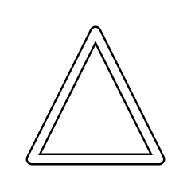

[](https://github.com/PaulioRandall/p45/releases)
[](https://github.com/PaulioRandall/p45/releases)

# P45

Svelte library for programmatically crafting grid based SVG icons.

**Requires Svelte version 4.**

## Made to be Plundered

Fork, pillage, and plunder! Do whatever as long as you adhere to the project's permissive MIT license.

## Classes

### `P45`

The core class supplied to P45 components. It provides the context for P45 components such as grid size and certain named nodes.

It also provides functions for parsing command and transformation lists used by components such as `<Shape>` and `<Transform>`.

```js
class P45 {
  // Accepts size of the grid used as the unscaled width and height in pixels.
  // Size must be between 8 and 64.
  // Size must be divisible by 2.
  constructor(size=24) {
    this.size = size
    this.center // '12' for default size
    this.centerNode // 'M12' for default size
    this.topLeftNode
    this.topCenterNode
    this.topRightNode
    this.centerLeftNode
    this.centerCenterNode
    this.centerRightNode
    this.bottomLeftNode
    this.bottomCenterNode
    this.bottomRightNode
  }

  // Parses nodes such as `M12` into coordinates such as `{ x: 12, y: 12 }`.
  parseNode(node);

  // Converts coordinates such as `x=12` and `y=12` into nodes such as `M12`.
  nodeOf(x, y);

  // Converts the number `n` into it's base 26 alphabetic representation.
  numberToAlpha(n);

  // Parses a string or array of strings representing
  // draw commands for a single shape and returns a
  // string used in SVG paths like this `<path d={result} />`.
  parseDrawCommands(commands);

  // Parses a string or array of strings representing
  // transform commands for a single element and returns a
  // string used for the SVG transform attribute like this
  // `<path transform={result} />` or `<g transform={result} />`.
  parseTransformCommands(commands);
}
```

```svelte
<script>
	import { P45, Icon, Shape } from 'p45'

	const p45 = new P45()
</script>

<Icon {p45} width="300" height="300">
	<!-- Simple triangle -->
	<Shape
		draw="
      move to E20
      line to U20
      line to M4
      close
  " />
</Icon>
```

Illustration of the above drawing but with some minor modifications so it's visible on GitHub and other platforms.



### Draw Commands

**`move to <node>`**

- _move to D3_ => `M 3 3`
- _move to M8_ => `M 12 8`

**`line to <node>`**

- _line to D3_ => `L 3 3`
- _line to M8_ => `L 12 8`

**`[cubic] curve to <node> control with <node> [and <node>]`**

- _curve to M8 control with D3_ => `S 3 3 12 8`
- _curve to M8 control with D3 and F6_ => `C 3 3 6 6 12 8`

**`(quad|quadratic) curve to <node> [control with <node>]`**

- _(quad | quadratic) curve to M8_ => `T 12 8`
- _(quad | quadratic) curve to M8 control with D3_ => `Q 3 3 12 8`

**`arc to <node> with radius <number> and <number> [and rotation <number>] [and is large] [and is sweeping]`**

- _arc to M8 with radius 6 and 10_ => `A 6 10 0 0 0 12 8`
- _arc to M8 with radius 6 and 10 and rotation 45_ => `A 6 10 45 0 0 12 8`
- _arc to M8 with radius 6 and 10 and is large_ => `A 6 10 0 1 0 12 8`
- _arc to M8 with radius 6 and 10 and is sweeping_ => `A 6 10 0 0 1 12 8`
- _arc to M8 with radius 6 and 10 and rotation 45 and is large and is sweeping_ => `A 6 10 45 1 1 12 8`

**`close`** (connects the ends of the shape together)

- _close_ => `z`

### Transform Commands

**`move by <number>`**

- _move by D3_ => `translate(3 3)`
- _move by M8_ => `translate(12 8)`

**`move <direction> by <number>`**

- _move up by 3_ => `translate(0 -3)`
- _move down by 3_ => `translate(0 3)`
- _move left by 3_ => `translate(-3 0)`
- _move right by 3_ => `translate(3 0)`

**`rotate by <number> [around <node>]`**

- rotate by 45\_ => `rotate(45)`
- rotate by 45 around M8\_ => `rotate(45, 12, 8)`

**`scale [x|y] by <number>`**

- _scale by 2_ => `scale(2 2)`
- _scale x by 2_ => `scale(2 0)`
- _scale y by 2_ => `scale(0 2)`

**`scale [x|y|width|height|horizontally|vertically] by <number>`**

- _scale by 2_ => `scale(2 2)`
- _scale x by 2_ => `scale(2 1)`
- _scale y by 2_ => `scale(1 2)`

**`flip [x|y|width|height|horizontally|vertically]`**

- _flip_ => `scale(-1 -1)`
- _flip x_ => `scale(-1 1)`
- _flip y_ => `scale(1 -1)`

**`skew [x|y|width|height|horizontally|vertically] by <number>`**

- _skew by 20_ => `skewX(20) skewY(20)`
- _skew x by 20_ => `skewX(20)`
- _skew y by 20_ => `skewY(20)`

## Components

### `<Circle>`

Creates a circle from a center origin and radius.

```svelte
<script>
  // P45 instance to use as grid and context.
  export let p45 = getContext('p45')

  // Circle center point.
  export let origin = p45.centerNode

  // Circle radius.
  export let radius = p45.center - 1
</script>

<!-- Any elements allowable within a `<circle>`. -->
<slot />
```

```svelte
<Circle
  p45={getContext('p45')}
  origin={p45.centerNode}
  radius={p45.center - 1}
>
  <div />
</Circle>
```

### `<Icon>`

Container for slotted shapes that form an Icon.

It's represented by an svg element sized by the passed P45 instance.
Raw svg child elements maybe slotted in too.

```svelte
<script>
  // An instance of the P45 class.
  export let p45 = getContext('p45')

  // The icon's title applied using the SVG title tag.
  export let title = ""

  // Description of the icon applied using the SVG description tag.
  export let description = ""

  // P45 instance used to size the icon and parse nodes.
  setContext("p45", ...)
</script>

<!-- SVG elments and components that form the icon. -->
<slot />
```

```svelte
<Icon
  p45={getContext('p45')}
  title=""
  description=""
>
  <div />
</Icon>
```

### `<Mask>`

Creates a referencable mask for cutting holes in other shapes.

```svelte
<script>
  // P45 instance to use as grid and context.
  export let p45 = getContext('p45')

  // Unique ID to reference the mask.
  export let id
</script>

<!-- Elments and components that form the hole in the referencing shape. -->
<slot />
```

```svelte
<Mask
  p45={getContext('p45')}
  id
>
  <div />
</Mask>
```

### `<RegularPolygon>`

Creates a regular polygon from an origin center point, number of edges,
and radius to a vertex.

```svelte
<script>
  // P45 instance to use as grid and context.
  export let p45 = getContext('p45')

  // Origin to use for transforms.
  export let origin = p45.centerNode

  // Number of sides.
  export let sides = 6

  // Circle radius.
  export let radius = p45.center - 1

  // Amount to rotate counter clockwise in degrees, may be negative.
  export let rotate = 0
</script>

<!-- Any elements allowable within a `<polygon>`. -->
<slot />
```

```svelte
<RegularPolygon
  p45={getContext('p45')}
  origin={p45.centerNode}
  sides={6}
  radius={p45.center - 1}
  rotate={0}
>
  <div />
</RegularPolygon>
```

### `<Shape>`

Creates a shape from three or more points.

```svelte
<script>
  // P45 instance to use as grid and context.
  export let p45 = getContext('p45')

  // Either an array off commands or a line separated list of commands.
  export let commands = /* Simple Wallace & Gromit rocket drawing */

  // ID of a mask cut out.
  export let mask = ""

  // Either an array off commands or a line separated list of commands.
  export let transforms = ""

  // Origin to use for transforms.
  export let origin = p45.centerNode
</script>

<!-- Any elements allowable within a `<path>`. -->
<slot />
```

```svelte
<Shape
  p45={getContext('p45')}
  commands={/* Simple Wallace & Gromit rocket drawing */}
  mask=""
  transforms=""
  origin={p45.centerNode}
>
  <div />
</Shape>
```

### `<Transform>`

Creates a group for simple transformations.

```svelte
<script>
  // P45 instance to use as grid and context.
  export let p45 = getContext('p45')

  // Either an array off commands or a line separated list of commands.
  export let transforms = ""

  // Origin to use for transforms.
  export let origin = p45.centerNode
</script>

<!-- Components and elements to transform within a `<g>`. -->
<slot />
```

```svelte
<Transform
  p45={getContext('p45')}
  transforms=""
  origin={p45.centerNode}
>
  <div />
</Transform>
```
